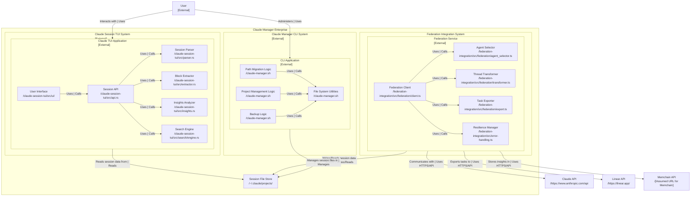

# Unnamed CodeViz Diagram

```mermaid
graph TD

    user["User<br>[External]"]
    claude_api["Claude API<br>/https://www.anthropic.com/api"]
    linear_api["Linear API<br>/https://linear.app/"]
    memchain_api["Memchain API<br>/[Assumed URL for Memchain]"]
    subgraph claude_manager_enterprise["Claude Manager Enterprise<br>[External]"]
        session_file_store["Session File Store<br>/~/.claude/projects/"]
        subgraph claude_session_tui_system["Claude Session TUI System<br>[External]"]
            subgraph claude_tui_app_boundary["Claude TUI Application<br>[External]"]
                session_api["Session API<br>/claude-session-tui/src/api.rs"]
                session_parser["Session Parser<br>/claude-session-tui/src/parser.rs"]
                block_extractor["Block Extractor<br>/claude-session-tui/src/extractor.rs"]
                insights_analyzer["Insights Analyzer<br>/claude-session-tui/src/insights.rs"]
                search_engine["Search Engine<br>/claude-session-tui/src/search/engine.rs"]
                user_interface["User Interface<br>/claude-session-tui/src/ui/"]
                %% Edges at this level (grouped by source)
                session_api["Session API<br>/claude-session-tui/src/api.rs"] -->|"Uses | Calls"| session_parser["Session Parser<br>/claude-session-tui/src/parser.rs"]
                session_api["Session API<br>/claude-session-tui/src/api.rs"] -->|"Uses | Calls"| block_extractor["Block Extractor<br>/claude-session-tui/src/extractor.rs"]
                session_api["Session API<br>/claude-session-tui/src/api.rs"] -->|"Uses | Calls"| insights_analyzer["Insights Analyzer<br>/claude-session-tui/src/insights.rs"]
                session_api["Session API<br>/claude-session-tui/src/api.rs"] -->|"Uses | Calls"| search_engine["Search Engine<br>/claude-session-tui/src/search/engine.rs"]
                user_interface["User Interface<br>/claude-session-tui/src/ui/"] -->|"Uses | Calls"| session_api["Session API<br>/claude-session-tui/src/api.rs"]
            end
        end
        subgraph federation_integration_system["Federation Integration System<br>[External]"]
            subgraph federation_service_boundary["Federation Service<br>[External]"]
                federation_client["Federation Client<br>/federation-integration/src/federation/client.ts"]
                agent_selector["Agent Selector<br>/federation-integration/src/federation/agent_selector.ts"]
                thread_transformer["Thread Transformer<br>/federation-integration/src/federation/transformer.ts"]
                task_exporter["Task Exporter<br>/federation-integration/src/federation/export.ts"]
                resilience_manager["Resilience Manager<br>/federation-integration/src/error-handling.ts"]
                %% Edges at this level (grouped by source)
                federation_client["Federation Client<br>/federation-integration/src/federation/client.ts"] -->|"Uses | Calls"| agent_selector["Agent Selector<br>/federation-integration/src/federation/agent_selector.ts"]
                federation_client["Federation Client<br>/federation-integration/src/federation/client.ts"] -->|"Uses | Calls"| thread_transformer["Thread Transformer<br>/federation-integration/src/federation/transformer.ts"]
                federation_client["Federation Client<br>/federation-integration/src/federation/client.ts"] -->|"Uses | Calls"| task_exporter["Task Exporter<br>/federation-integration/src/federation/export.ts"]
                federation_client["Federation Client<br>/federation-integration/src/federation/client.ts"] -->|"Uses | Calls"| resilience_manager["Resilience Manager<br>/federation-integration/src/error-handling.ts"]
            end
        end
        subgraph claude_manager_cli_system["Claude Manager CLI System<br>[External]"]
            subgraph cli_application_boundary["CLI Application<br>[External]"]
                path_migration_logic["Path Migration Logic<br>/claude-manager.sh"]
                project_management_logic["Project Management Logic<br>/claude-manager.sh"]
                backup_logic["Backup Logic<br>/claude-manager.sh"]
                file_system_utilities["File System Utilities<br>/claude-manager.sh"]
                %% Edges at this level (grouped by source)
                path_migration_logic["Path Migration Logic<br>/claude-manager.sh"] -->|"Uses | Calls"| file_system_utilities["File System Utilities<br>/claude-manager.sh"]
                project_management_logic["Project Management Logic<br>/claude-manager.sh"] -->|"Uses | Calls"| file_system_utilities["File System Utilities<br>/claude-manager.sh"]
                backup_logic["Backup Logic<br>/claude-manager.sh"] -->|"Uses | Calls"| file_system_utilities["File System Utilities<br>/claude-manager.sh"]
            end
        end
        %% Edges at this level (grouped by source)
        claude_tui_app_boundary["Claude TUI Application<br>[External]"] -->|"Reads session data from | Reads"| session_file_store["Session File Store<br>/~/.claude/projects/"]
        federation_service_boundary["Federation Service<br>[External]"] -->|"Writes/Reads session data to/from | Writes/Reads"| session_file_store["Session File Store<br>/~/.claude/projects/"]
        cli_application_boundary["CLI Application<br>[External]"] -->|"Manages session files in | Manages"| session_file_store["Session File Store<br>/~/.claude/projects/"]
    end
    %% Edges at this level (grouped by source)
    user["User<br>[External]"] -->|"Interacts with | Uses"| claude_tui_app_boundary["Claude TUI Application<br>[External]"]
    user["User<br>[External]"] -->|"Administers | Uses"| cli_application_boundary["CLI Application<br>[External]"]
    federation_service_boundary["Federation Service<br>[External]"] -->|"Communicates with | Uses HTTPS/API"| claude_api["Claude API<br>/https://www.anthropic.com/api"]
    federation_service_boundary["Federation Service<br>[External]"] -->|"Exports tasks to | Uses HTTPS/API"| linear_api["Linear API<br>/https://linear.app/"]
    federation_service_boundary["Federation Service<br>[External]"] -->|"Stores insights in | Uses HTTPS/API"| memchain_api["Memchain API<br>/[Assumed URL for Memchain]"]

```
---
*Generated by [CodeViz.ai](https://codeviz.ai) on 9/9/2025, 7:24:07 PM*
